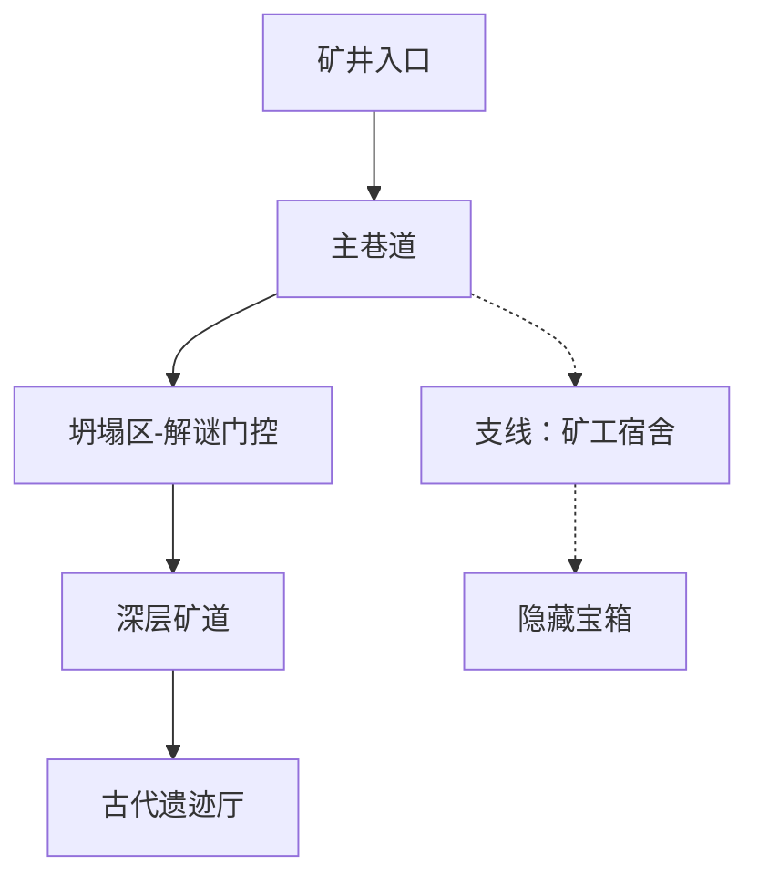

## 概述

关卡规格生成技能负责将关卡概念转化为详细的关卡设计文档。定义关卡的空间拓扑结构（区域划分和连通关系）、强度曲线（节奏控制）、玩法元素分布和敌人/障碍配置。确保关卡体验节奏合理，玩法多样性与难度递进平衡。

## 步骤

1. **定义关卡框架** — 确定关卡类型（线性/开放/混合）、预计时长、难度定位和叙事功能
2. **设计空间拓扑** — 划分区域，定义区域间的连通关系和门控机制（钥匙、技能、剧情触发）
3. **规划强度曲线** — 设计关卡的紧张-放松节奏，标注高潮、休息和转折点
4. **分布玩法元素** — 在各区域配置战斗、解谜、探索、叙事等玩法元素
5. **配置敌人和物品** — 定义各区域的敌人种类、数量和物品/收集品位置

## 输出格式

```markdown
# 关卡规格：[关卡名称]

## 概述
- **关卡类型**: [线性 | 开放 | 混合]
- **预计时长**: [分钟]
- **难度**: [1-10]
- **叙事功能**: [描述]

## 空间拓扑
（Mermaid 图表展示区域关系）

## 强度曲线
| 区域 | 强度(1-10) | 节奏 | 主要活动 |
|------|------------|------|----------|

## 玩法分布
| 区域 | 战斗 | 探索 | 解谜 | 叙事 | 说明 |
|------|------|------|------|------|------|

## 敌人配置
| 区域 | 敌人类型 | 数量 | 难度 | 特殊机制 |
|------|----------|------|------|----------|

## 收集品分布
| 物品 | 位置 | 获取方式 | 可见性 |
|------|------|----------|--------|
```

## 示例

**输入**:
- level_concept: "废弃矿井，玩家需要深入矿井底部找到古代遗物"
- gameplay_constraints: "战斗+探索为主，含1个解谜门控，时长15-20分钟"

**输出**:

```markdown
# 关卡规格：幽暗矿井

## 概述
- **关卡类型**: 线性（含支线探索）
- **预计时长**: 18分钟
- **难度**: 4/10
- **叙事功能**: 揭示古代文明线索

## 空间拓扑


## 强度曲线
| 区域 | 强度(1-10) | 节奏 | 主要活动 |
|------|------------|------|----------|
| 矿井入口 | 2 | 缓慢引入 | 环境叙事、探索 |
| 主巷道 | 5 | 渐进紧张 | 小规模战斗 |
| 坍塌区 | 3 | 短暂放松 | 解谜 |
| 深层矿道 | 7 | 高强度 | 连续战斗 |
| 古代遗迹厅 | 9 | 高潮 | Boss战 |
```
