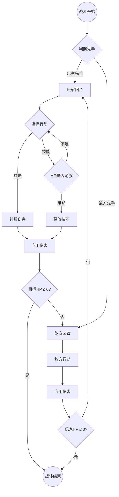
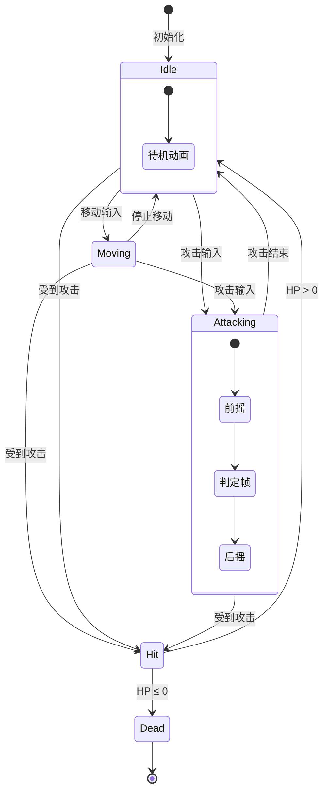

## 概述

Mermaid 图表绘制技能负责将文字描述转化为标准 Mermaid 语法的图表代码。支持流程图（flowchart）、状态机图（stateDiagram）、时序图（sequenceDiagram）、拓扑图（graph/flowchart 实现）、类图（classDiagram）和甘特图（gantt）等类型。生成的代码可直接嵌入 Markdown 文档中渲染。

## 步骤

1. **选择图表类型**
   - 根据输入的 `chart_type` 确定 Mermaid 图表语法
   - 若未指定，根据内容特征自动推断：
     - 包含"流程/步骤/判断" → flowchart
     - 包含"状态/转换/切换" → stateDiagram-v2
     - 包含"交互/请求/响应/消息" → sequenceDiagram
     - 包含"连接/拓扑/网络/关系" → flowchart（拓扑模式）
     - 包含"继承/属性/方法" → classDiagram
     - 包含"时间线/排期/计划" → gantt

2. **定义节点**
   - 从内容描述中提取关键实体作为节点
   - 为每个节点分配简短的 ID（使用英文驼峰或下划线命名）
   - 定义节点显示文本（使用中文）
   - 选择节点形状：
     - `[文本]` — 矩形（普通步骤）
     - `(文本)` — 圆角矩形（起止）
     - `{文本}` — 菱形（判断）
     - `((文本))` — 圆形（事件）
     - `[[文本]]` — 子程序
     - `[(文本)]` — 数据库

3. **定义关系**
   - 确定节点之间的连接关系和方向
   - 选择连接线样式：
     - `-->` 实线箭头
     - `-.->` 虚线箭头
     - `==>` 粗线箭头
     - `---` 无箭头连线
   - 在连接线上添加标签文字（如条件、动作）
   - 注意避免产生语法冲突的特殊字符

4. **生成代码**
   - 按照 Mermaid 语法规范组装完整代码
   - 添加样式定义（如有需要）
   - 使用 `subgraph` 对复杂图表进行分组
   - 验证语法正确性（括号匹配、关键字正确）

## 输出格式

````markdown
```mermaid
[图表类型声明]
    [节点和关系定义]
    [样式定义（可选）]
```

**节点说明**（可选）：
| 节点ID | 说明 |
|--------|------|
| [id] | [说明] |
````

## 示例

### 示例1：战斗流程图

**输入**:
- chart_type: flowchart
- content_description: "玩家进入战斗后，先判断是否先手，先手方先行动。行动时选择攻击或技能，攻击直接计算伤害，技能需要判断MP是否足够。行动结束后切换到对方回合，直到一方HP为0战斗结束。"

**输出**:



### 示例2：角色状态机

**输入**:
- chart_type: stateDiagram
- content_description: "角色有站立、移动、攻击、受击、死亡五个状态。站立可以切换到移动或攻击，移动可以切换到站立或攻击，攻击结束回到站立，任何状态受击进入受击状态，受击后如果HP>0回到站立否则进入死亡。"

**输出**:


