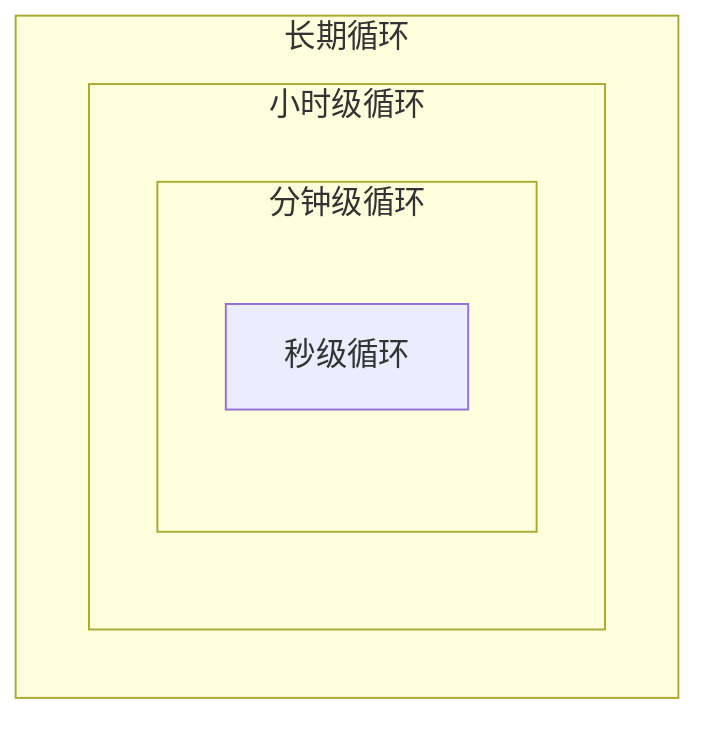

# [项目名称] 核心循环

> [用一句话概括游戏的核心循环本质——玩家反复做什么，为什么愿意反复做？]

---

## 1. 核心游戏循环总览

[用文字简要描述核心游戏循环的完整流程，然后用 Mermaid 图表可视化。]

[替换上述 Mermaid 图为本项目实际的核心循环流程。标注每个节点的具体含义和转化条件。]

---

## 2. 秒级循环（即时反馈层）

[描述玩家每秒钟都在进行的最基础操作循环——这是手感和即时满足感的来源。]

### 循环描述

- **输入**：[玩家的基础操作是什么——点击、滑动、按键组合？]
- **过程**：[操作触发的即时游戏反应是什么——角色动作、技能释放、物理碰撞？]
- **反馈**：[即时反馈是什么——打击感、音效、粒子特效、数值弹出？]
- **满足感来源**：[为什么这个秒级循环让人觉得"爽"或"舒服"？]

### 设计要点

[列出秒级循环的关键设计指标——输入延迟要求、动画帧数、反馈层次等]

---

## 3. 分钟级循环（战术层）

[描述玩家在几分钟内完成的战术层循环——单场战斗、单次采集、单个谜题等。]

### 循环描述

- **目标**：[玩家在这个循环中要达成的短期目标是什么？]
- **过程**：[达成目标的过程涉及哪些决策和操作？]
- **变量**：[哪些因素让每次循环都略有不同——随机性、敌人组合、地形？]
- **奖励**：[完成循环后获得的奖励——经验值、材料、装备、技能点？]
- **时长**：[单次循环的目标时长范围]

### 设计要点

[列出分钟级循环的关键设计指标——单次时长、难度曲线、奖励节奏等]

---

## 4. 小时级循环（策略层）

[描述玩家在数小时内完成的策略层循环——一次副本、一条任务线、一个区域探索等。]

### 循环描述

- **目标**：[玩家在这个循环中追求的中期目标是什么？]
- **规划**：[玩家需要做哪些策略性规划——队伍搭配、资源分配、路线选择？]
- **阶段**：[这个循环分为哪几个阶段——准备、执行、结算？]
- **奖励**：[完成循环后的奖励——装备升级、新区域解锁、剧情推进？]
- **时长**：[单次循环的目标时长范围]

### 设计要点

[列出小时级循环的关键设计指标——内容量、节奏控制、目标清晰度等]

---

## 5. 长期循环（元进度层）

[描述跨越数天、数周甚至数月的长期循环——赛季、角色养成、终局内容等。]

### 循环描述

- **长期目标**：[玩家的长期追求是什么——角色满级、收集全成就、排名攀升？]
- **驱动力**：[什么驱动玩家持续回来——新内容更新、社交义务、收集欲？]
- **里程碑**：[长期循环中有哪些关键里程碑让玩家感受到进度？]
- **终局形态**：[当玩家"毕业"后，游戏的终局体验是什么？]

### 设计要点

[列出长期循环的关键设计指标——留存节奏、内容消耗速度、社交粘性等]

---

## 6. 循环间关系

[描述不同层级循环之间如何嵌套、驱动和强化。]

### 嵌套关系图

[替换上述 Mermaid 图为本项目实际的循环嵌套关系。标注每层循环如何为上层循环提供动力。]

### 驱动关系

| 底层循环 | 驱动方式 | 上层循环 |
|----------|---------|----------|
| [秒级循环的具体行为] | [如何汇聚和转化] | [分钟级循环的具体目标] |
| [分钟级循环的奖励] | [如何汇聚和转化] | [小时级循环的具体进度] |
| [小时级循环的成果] | [如何汇聚和转化] | [长期循环的里程碑] |

---

## 7. 循环验证清单

- [ ] 秒级循环是否提供了足够的即时满足感？
- [ ] 分钟级循环是否有足够的变化避免重复感？
- [ ] 小时级循环是否有清晰的目标引导？
- [ ] 长期循环是否有足够的驱动力维持留存？
- [ ] 每层循环的奖励是否能有效驱动上层循环？
- [ ] 循环是否与设计支柱保持一致？
