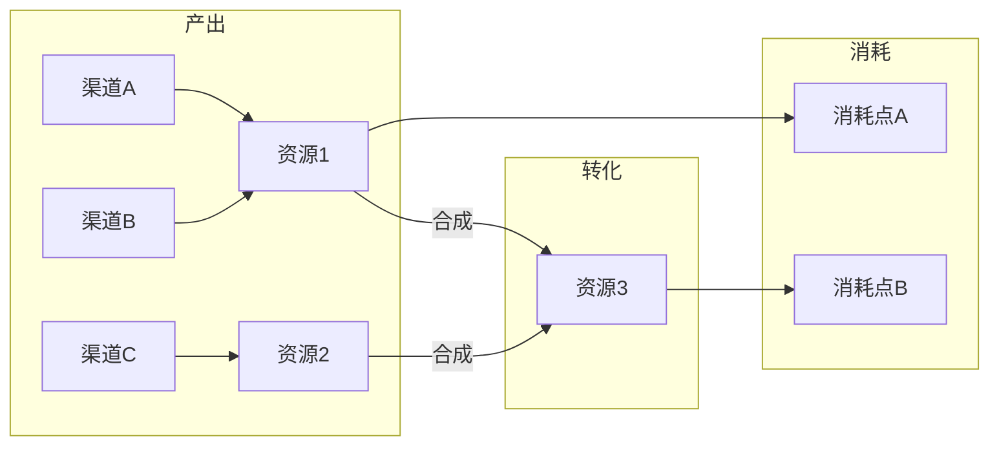

# [项目名称] 资源流设计

> [用一句话概括本游戏的经济系统设计理念——资源流如何服务于核心体验？]

---

## 1. 资源类型清单

[列出游戏中所有资源类型，按层级和用途分类。]

### 基础资源

| 资源ID | 资源名称 | 类型 | 上限 | 说明 |
|--------|---------|------|------|------|
| [RES_001] | [资源名] | [货币/材料/能量/其他] | [有无上限及数值] | [资源的基本用途说明] |
| [RES_002] | [资源名] | [...] | [...] | [...] |

### 高级资源

| 资源ID | 资源名称 | 合成来源 | 上限 | 说明 |
|--------|---------|----------|------|------|
| [RES_101] | [资源名] | [由哪些基础资源合成] | [...] | [...] |

### 特殊资源

| 资源ID | 资源名称 | 获取方式 | 上限 | 说明 |
|--------|---------|----------|------|------|
| [RES_201] | [资源名] | [限定获取方式] | [...] | [...] |

---

## 2. 产出渠道

[描述每种资源的所有产出来源及产出速率。]

| 资源 | 产出渠道 | 产出频率 | 单次产出量 | 每日预期产出 | 备注 |
|------|---------|---------|-----------|------------|------|
| [资源名] | [战斗掉落/任务奖励/商店购买/自然恢复/...] | [每次战斗/每日/每周] | [数量范围] | [预期总量] | [特殊条件或限制] |
| [...] | [...] | [...] | [...] | [...] | [...] |

---

## 3. 消耗渠道

[描述每种资源的所有消耗去向及消耗速率。]

| 资源 | 消耗渠道 | 消耗频率 | 单次消耗量 | 每日预期消耗 | 备注 |
|------|---------|---------|-----------|------------|------|
| [资源名] | [装备强化/技能升级/商店购买/...] | [频率] | [数量范围] | [预期总量] | [特殊条件或限制] |
| [...] | [...] | [...] | [...] | [...] | [...] |

---

## 4. 资源流图

[用 Mermaid 图表可视化资源的流入、流转、流出关系。]

[替换上述 Mermaid 图为本项目实际的资源流。标注每条边的转化比例或条件。]

---

## 5. 经济平衡约束

### 核心约束

[定义资源经济的核心平衡原则。]

- **产消比**：[整体产出与消耗的目标比例，例如"中期玩家每日产出应略大于消耗，维持温和增长"]
- **通胀控制**：[如何防止资源过度堆积——是否有资源衰减、消耗陷阱、上限机制？]
- **付费边界**：[付费与免费玩家的资源获取差距上限，例如"付费玩家的资源获取效率不超过免费玩家的 X 倍"]
- **新手保护**：[新玩家在前 N 天的资源保障机制]

### 关键指标

| 指标 | 目标值 | 警戒值 | 说明 |
|------|--------|--------|------|
| [指标名称，如"日均金币净增长"] | [目标范围] | [异常阈值] | [为什么这个指标重要] |
| [...] | [...] | [...] | [...] |

### 调控手段

[当经济出现失衡时，有哪些调控手段？]

- [手段1：例如"通过限时活动增加消耗渠道"]
- [手段2：例如"调整产出概率的服务端热更"]
- [手段3：例如"引入新的资源消耗需求"]

---

## 6. 资源流验证清单

- [ ] 每种资源是否都有明确的产出和消耗渠道？
- [ ] 是否存在没有消耗出口的资源（死水资源）？
- [ ] 产消比是否在合理范围内？
- [ ] 付费设计是否在约束边界内？
- [ ] 资源流是否与核心循环保持一致？
