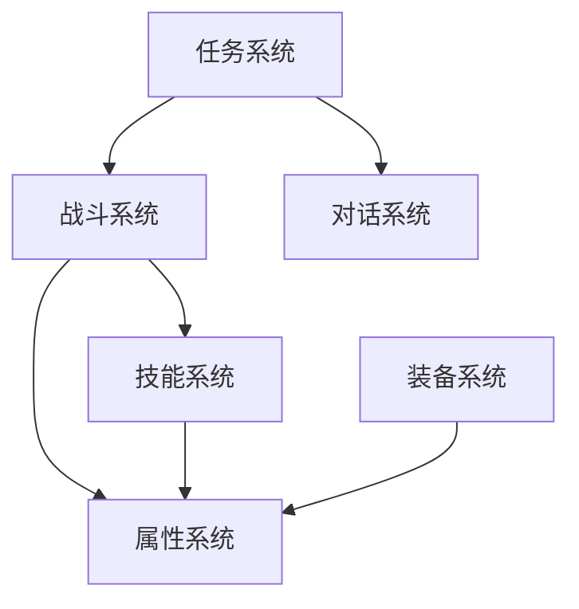
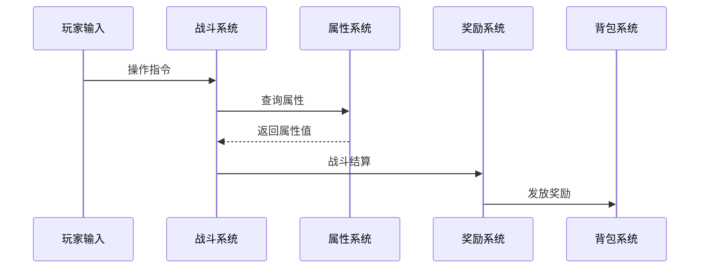

# [项目名称] 系统架构

> [用一句话概括系统架构的设计理念——系统间如何协作来支撑游戏体验？]

---

## 1. 系统清单

[列出游戏中所有子系统，按功能域分类。]

### 核心玩法系统

| 系统ID | 系统名称 | 优先级 | 负责人 | 状态 | 简述 |
|--------|---------|--------|--------|------|------|
| [SYS_001] | [系统名] | [P0/P1/P2] | [负责人] | [规划中/开发中/已完成] | [一句话描述系统职责] |
| [SYS_002] | [...] | [...] | [...] | [...] | [...] |

### 支撑系统

| 系统ID | 系统名称 | 优先级 | 负责人 | 状态 | 简述 |
|--------|---------|--------|--------|------|------|
| [SYS_101] | [系统名] | [...] | [...] | [...] | [...] |

### 社交/元游戏系统

| 系统ID | 系统名称 | 优先级 | 负责人 | 状态 | 简述 |
|--------|---------|--------|--------|------|------|
| [SYS_201] | [系统名] | [...] | [...] | [...] | [...] |

---

## 2. 系统依赖关系图

[用 Mermaid 图表可视化系统间的依赖关系——哪些系统依赖哪些系统。]

[替换上述 Mermaid 图为本项目实际的系统依赖关系。箭头方向表示"依赖于"。]

---

## 3. 数据流向

[描述关键数据在系统间的流动方向。]

### 核心数据流

[替换上述 Mermaid 图为本项目实际的核心数据流。标注关键数据包的内容。]

### 接口清单

| 提供方系统 | 接口名称 | 消费方系统 | 数据格式 | 调用频率 |
|-----------|---------|-----------|---------|---------|
| [系统A] | [接口名] | [系统B] | [数据结构简述] | [每帧/每秒/事件触发] |
| [...] | [...] | [...] | [...] | [...] |

---

## 4. 技术约束

### 性能要求

| 约束项 | 目标值 | 说明 |
|--------|--------|------|
| [帧率] | [目标FPS] | [最低硬件配置下的帧率要求] |
| [加载时间] | [目标秒数] | [场景切换/系统初始化的最大时长] |
| [内存占用] | [目标MB] | [各系统的内存预算] |
| [网络延迟] | [目标ms] | [关键操作的最大容忍延迟] |
| [同屏实体] | [目标数量] | [最大同屏角色/特效/物件数量] |

### 平台约束

[列出目标平台的特殊技术限制——移动端内存限制、主机端认证要求、PC端配置范围等。]

### 架构原则

- [原则1：例如"所有系统通过事件总线通信，禁止直接引用"]
- [原则2：例如"数值配置与逻辑代码分离，支持热更"]
- [原则3：例如"客户端不信任原则，关键计算在服务端执行"]

---

## 5. 系统架构验证清单

- [ ] 所有系统是否都已列出且分类合理？
- [ ] 依赖关系图中是否存在循环依赖？
- [ ] 数据流是否存在瓶颈或单点故障？
- [ ] 技术约束是否与目标平台匹配？
- [ ] 架构是否支持后续的内容扩展？
