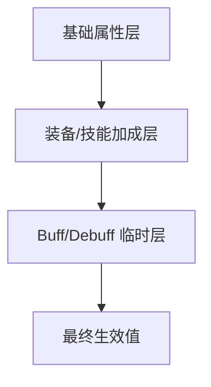

# [系统名称] 数值配置规范

> [用一句话概括这套数值体系的设计目标——数值如何服务于玩家体验？]

---

## 0. 运行时数据参与声明

> 首轮数据 authoring 契约放在正文固定区块，不扩展文档 frontmatter。

```yaml
design_runtime_contract:
  config_surface: direct
  review_card_required: true
  runtime_export_mode: direct | derived
  decision_block_ids:
    - DEC_NUM_001_EXAMPLE
```

- 使用本模板时，默认不建议写 `config_surface: none`；若只是做纯分析草稿，优先改用探索或评审文档而不是冒充正式数值配置规范。

---

## 1. 数值框架概述

### 1.1 设计理念

[阐述数值设计的核心理念——追求公平竞技、追求养成深度、追求策略多样性？数值体验的目标感受是什么？]

### 1.2 数值层级

[描述数值体系的层级结构——从基础属性到最终战力的计算层级。]



[替换上述 Mermaid 图为本系统实际的数值计算层级。标注每层的计算顺序和叠加方式。]

### 1.3 数值分类

| 分类 | 说明 | 示例 |
|------|------|------|
| 固定值 | [不随等级/时间变化的常量] | [例如：基础移动速度、技能冷却时间] |
| 成长值 | [随等级/进度线性或曲线增长的值] | [例如：生命值、攻击力] |
| 随机值 | [在一定范围内随机的值] | [例如：暴击率、掉落概率] |
| 派生值 | [由其他值计算得出的值] | [例如：DPS、有效生命值] |

---

## 2. 核心公式（使用 {{VAR_}} 变量）

### 2.1 伤害公式

```
最终伤害 = {{VAR_技能基础伤害}} * {{VAR_攻击力}} / ({{VAR_攻击力}} + {{VAR_防御力}} * {{VAR_防御系数}}) * {{VAR_伤害波动}}
```

- **变量说明**：
  - `{{VAR_技能基础伤害}}`：[来源于技能配置表，不同技能有不同的基础伤害值]
  - `{{VAR_攻击力}}`：[攻击方的最终攻击力属性值]
  - `{{VAR_防御力}}`：[防御方的最终防御力属性值]
  - `{{VAR_防御系数}}`：[全局防御衰减系数，默认值 = [填入]，用于调控防御的有效性]
  - `{{VAR_伤害波动}}`：[随机波动范围，默认 0.9~1.1]
- **设计意图**：[解释为什么选择这个公式结构——是为了让防御有递减收益、还是为了让攻击始终有效？]

### 2.2 经验公式

```
升级所需经验 = {{VAR_经验基数}} * {{VAR_等级}} ^ {{VAR_经验指数}} + {{VAR_经验常数}}
```

- **变量说明**：
  - `{{VAR_经验基数}}`：[基础经验值，默认值 = [填入]]
  - `{{VAR_等级}}`：[当前等级]
  - `{{VAR_经验指数}}`：[增长指数，默认值 = [填入]，控制升级速度的曲线陡峭程度]
  - `{{VAR_经验常数}}`：[常数偏移，默认值 = [填入]]
- **设计意图**：[解释增长曲线的选择理由]

### 2.3 [自定义公式名称]

```
[公式定义，使用 {{VAR_}} 标记所有可配置变量]
```

- **变量说明**：[逐一说明每个变量的含义、来源、默认值]
- **设计意图**：[解释公式设计理由]

[根据系统需要继续添加更多公式...]

---

## 3. 参数表

### 3.1 基础属性参数

| 参数ID | 参数名称 | 变量标记 | 类型 | 默认值 | 最小值 | 最大值 | 步长 | 说明 |
|--------|---------|---------|------|--------|--------|--------|------|------|
| [P_001] | [参数名] | `{{VAR_参数名}}` | [int/float] | [值] | [值] | [值] | [值] | [作用说明] |
| [P_002] | [...] | `{{VAR_...}}` | [...] | [...] | [...] | [...] | [...] | [...] |

### 3.2 战斗相关参数

| 参数ID | 参数名称 | 变量标记 | 类型 | 默认值 | 范围 | 影响公式 | 说明 |
|--------|---------|---------|------|--------|------|---------|------|
| [P_101] | [参数名] | `{{VAR_参数名}}` | [...] | [...] | [...] | [被哪个公式引用] | [...] |

### 3.3 经济相关参数

| 参数ID | 参数名称 | 变量标记 | 类型 | 默认值 | 范围 | 说明 |
|--------|---------|---------|------|--------|------|------|
| [P_201] | [参数名] | `{{VAR_参数名}}` | [...] | [...] | [...] | [...] |

### 3.4 结构化配置决策块

> 数值配置文档中的关键参数组，应使用 `decision_block` 说明玩家状态假设、设计意图、偏差风险和导出目标，而不是只给裸参数。

```yaml
decision_block:
  decision_block_id: DEC_NUM_001_EXAMPLE
  scope: [参数组作用域，例如 combat_damage/base_curve]
  req_ids:
    - REQ-NUM-001

  fact_source:
    review_mode: full | lean | prototype
    fact_state: working_assumption | formal_candidate | frozen
    confidence: low | medium | high

  player_state:
    playtime_hours: "[区间]"
    level_range: [[最小等级], [最大等级]]
    expected_resources:
      [资源字段]: [状态说明]
    mastered_mechanics:
      - [已掌握机制]

  intent:
    target_feel: "[目标体验]"
    target_behaviors:
      - [希望玩家形成的行为]
    non_goals:
      - [明确不追求的体验]

  decision:
    summary: "[一句话概括这组参数为什么这样配]"
    rationale:
      - "[理由 1]"

  risk_translation:
    too_high:
      player_symptoms:
        - "[偏高时玩家如何感知]"
      production_symptoms:
        - "[偏高时制作或维护如何受伤]"
    too_low:
      player_symptoms:
        - "[偏低时玩家如何感知]"
      production_symptoms:
        - "[偏低时制作或维护如何受伤]"

  constraints:
    hard_rules:
      - "[不可违反的数值红线]"
    watch_metrics:
      - "[应持续观察的指标]"

  runtime_link:
    export_mode: derived | direct
    targets:
      - target_id: "[导出目标标识]"
        target_type: datatable | data_asset | other
        entity_key: "[稳定主键]"
        fields:
          - "[字段名]"

  evidence:
    type: heuristic | specialist_review | simulation | playtest | reference_analysis
    sources:
      - "[SYSTEM_ID 或 REVIEW_ID]"
    notes:
      - "[补充说明]"

  workflow:
    owner_role: "[负责角色]"
    current_gate: "[当前门禁]"
    next_step: "[下一跳动作]"
```

---

## 4. 成长曲线

### 4.1 角色属性成长

[定义角色属性随等级增长的曲线。]

| 等级 | {{VAR_生命值}} | {{VAR_攻击力}} | {{VAR_防御力}} | 升级经验 | 累计经验 |
|------|---------------|---------------|---------------|---------|---------|
| 1 | [值] | [值] | [值] | [值] | [值] |
| 10 | [值] | [值] | [值] | [值] | [值] |
| 20 | [值] | [值] | [值] | [值] | [值] |
| 30 | [值] | [值] | [值] | [值] | [值] |
| [最大等级] | [值] | [值] | [值] | [值] | [值] |

### 4.2 曲线可视化

[用文字描述或标注成长曲线的形状特征——是线性、指数、对数还是S形？在哪些等级段加速/减速？为什么？]

- **前期（1-[N]级）**：[曲线特征——快速成长还是缓慢入门？设计理由。]
- **中期（[N]-[M]级）**：[曲线特征——稳定成长期的节奏设计。]
- **后期（[M]-[Max]级）**：[曲线特征——收益递减还是加速爆发？]

### 4.3 其他成长曲线

[根据系统需要，添加装备强化、技能升级、天赋解锁等其他维度的成长曲线。]

---

## 5. 平衡约束

### 5.1 核心约束条件

[定义数值平衡的硬性约束——这些是不可违反的数值红线。]

| 约束ID | 约束描述 | 约束公式/条件 | 违反后果 |
|--------|---------|-------------|---------|
| [BC_001] | [约束描述，例如"同等级PVE战斗应在X秒内结束"] | [具体的数值条件] | [如果违反会导致什么体验问题] |
| [BC_002] | [...] | [...] | [...] |
| [BC_003] | [...] | [...] | [...] |

### 5.2 平衡指标

| 指标名称 | 计算方式 | 目标范围 | 警戒范围 | 检查频率 |
|----------|---------|---------|---------|---------|
| [指标名] | [如何计算这个指标] | [健康的数值范围] | [需要关注的异常范围] | [多久检查一次] |
| [...] | [...] | [...] | [...] | [...] |

### 5.3 付费平衡

[如果涉及付费，定义付费与免费玩家之间的数值差距边界。]

- **数值差距上限**：[付费玩家在关键属性上最多比免费玩家高出百分之多少]
- **时间换算**：[付费可以节省多少时间，但不能突破免费玩家无法达到的数值天花板]
- **竞技公平**：[在竞技/PVP场景中，数值如何被规范化]

---

## 6. 模拟验证结果

### 6.1 模拟场景

[列出已进行的数值模拟场景及结果。]

| 场景 | 模拟条件 | 预期结果 | 实际结果 | 是否通过 | 备注 |
|------|---------|---------|---------|---------|------|
| [场景名称] | [模拟条件描述] | [预期数值或行为] | [实际模拟结果] | [是/否] | [偏差分析] |
| [...] | [...] | [...] | [...] | [...] | [...] |

### 6.2 关键数据点

[列出模拟中发现的关键数据点——拐点、异常值、敏感参数等。]

- [数据点1：例如"当防御系数超过 X 时，防御收益急剧下降"]
- [数据点2：例如"经验指数每增加 0.1，满级时间增加约 Y 小时"]

### 6.3 调优记录

| 调优日期 | 调整参数 | 调整前 | 调整后 | 调整原因 | 影响评估 |
|----------|---------|--------|--------|---------|---------|
| [日期] | `{{VAR_参数名}}` | [旧值] | [新值] | [为什么调整] | [调整后的影响] |

---

## 7. 数值配置验证清单

- [ ] 所有公式中的变量是否都使用了 {{VAR_}} 标记？
- [ ] 参数表中是否有遗漏的可配置项？
- [ ] 成长曲线是否与预期的游戏节奏匹配？
- [ ] 平衡约束是否都经过模拟验证？
- [ ] 付费边界是否明确且合理？
- [ ] 是否存在可能被极端利用的数值漏洞？
- [ ] 参数间是否存在意外的耦合关系？
