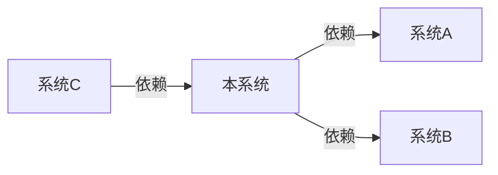
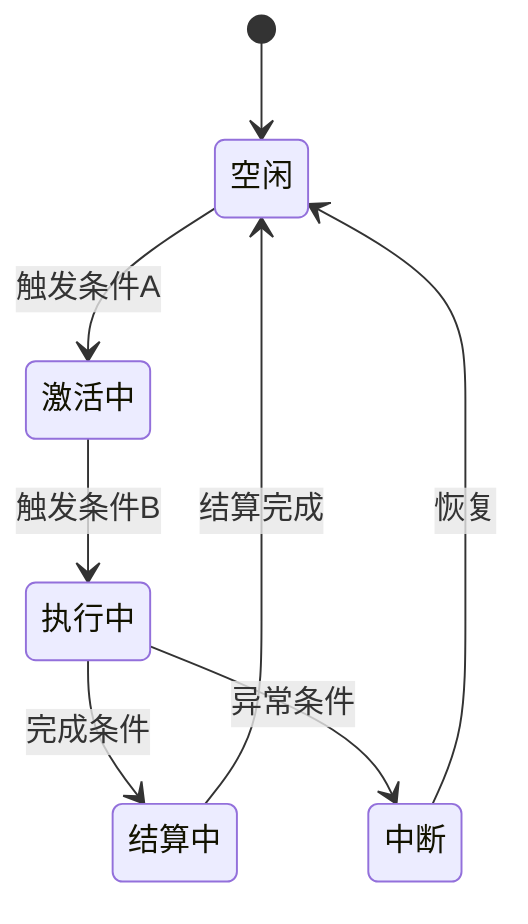
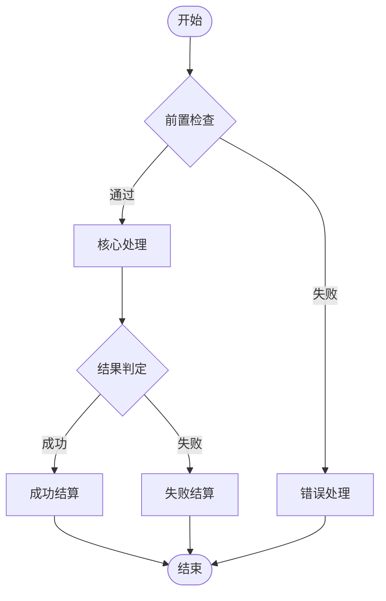
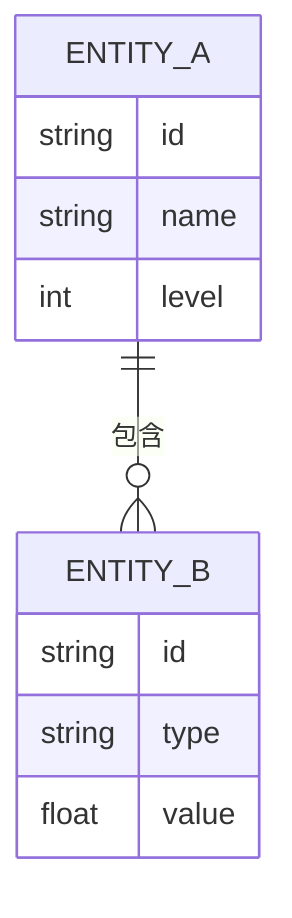
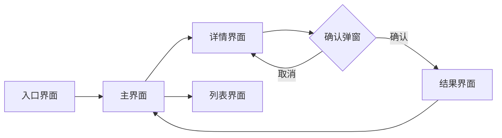

# SYS_[系统ID]_[系统名称]

> [用一句话概括这个系统的核心职责——它为玩家提供什么体验？]

## 0. 依赖文档与当前口径说明

> 本节用于声明当前系统设计所依赖的上游文档，以及这些依赖在本轮中的事实源强度。

### 0.1 依赖文档

- [SYS_XXX 上游系统文档](../02-system-design/SYS_XXX_上游系统文档.ai.md)
- [NARR_XXX 叙事约束文档](../03-narrative/NARR_XXX_叙事约束文档.ai.md)

### 0.2 当前口径说明

- **当前 review_mode**：[full / lean]
- **当前事实源解释**：[正式候选基线 / 工作假设]
- **假设性依赖说明**：[若依赖 `lean` 文档，在此明确写出“当前按该文档作为工作假设推进，尚不构成冻结事实”。若无可写“无”。]

### 0.3 运行时数据参与声明

> 首轮数据 authoring 契约放在正文固定区块，不扩展文档 frontmatter。

```yaml
design_runtime_contract:
    config_surface: none | indirect | direct
    review_card_required: true | false
    runtime_export_mode: none | derived | direct
    decision_block_ids:
        - DEC_SYS_001_EXAMPLE
```

- `none`：本文档不直接参与运行时数据导出；通常不需要完整决策块。
- `indirect`：本文档约束运行时数据，但不直接产出最终配置字段。
- `direct`：本文档直接定义可导出的配置语义，应补齐对应决策块。

---

## 1. 系统概述

### 1.1 设计目标

[列出这个系统的设计目标，按优先级排列。每个目标应该是可验证的。]

- **目标 1**：[描述这个系统要达成的首要目标，例如"提供有深度的战斗策略选择"]
- **目标 2**：[次要目标...]
- **目标 3**：[次要目标...]

### [可选] 体验手感目标

> 本节当前仅作提示，不是现阶段 formal review 的强制章节。

<!-- 演进触发器（P6）：如果你在写系统设计时反复想回答“这个机制玩起来应该是什么感觉”，但 `1.1 设计目标` 仍不足以承载这种描述，说明模板可能缺少 feel targets。若 2+ 份系统 GDD 都自然需要本节，应在当次输出中提示用户查看 ROADMAP 中的 P6。 -->

- **目标体验**：[玩家应该感受到什么，例如紧张感 / 掌控感 / 揭秘感 / 爽感 / 决策压力]
- **不追求的体验**：[明确不希望玩家在本系统中获得什么感觉]
- **体验主要来源**：[哪些机制、反馈、节奏或信息结构共同产生上述体验]

### 1.2 系统边界

[明确定义系统的职责范围——什么归这个系统管，什么不归它管。]

**系统职责（IN SCOPE）：**
- [职责1：这个系统负责处理什么]
- [职责2：...]

**不在范围内（OUT OF SCOPE）：**
- [排除项1：这个系统不负责什么，由哪个系统负责]
- [排除项2：...]

**输入/输出：**

| 方向 | 来源/目标系统 | 数据 | 触发条件 |
|------|-------------|------|---------|
| 输入 | [来源系统名] | [数据描述] | [什么时候触发] |
| 输出 | [目标系统名] | [数据描述] | [什么时候触发] |

### 1.3 关联系统



[替换上述 Mermaid 图为本系统实际的关联关系。标注依赖方向和交互内容。]

| 关联系统 | 关系类型 | 交互说明 |
|----------|---------|---------|
| [系统名] | [依赖/被依赖/双向] | [具体的数据交互或事件交互说明] |
| [...] | [...] | [...] |

### 1.4 理解链路声明

> 本节回答 PHILOSOPHY_001 Q4（孤岛还是点火）的核心问题：本系统在理解闭环中的位置是什么？

**本系统的定位**：[核心系统 / 外围系统]（判定依据：[移除本系统是否会断裂理解链路中的至少一条端到端路径]）

| 方向 | 理解碎片内容 | 来源/目标系统 | 转化效果 |
|------|-------------|-------------|---------|
| **生产** | [本系统产出什么理解碎片？] | → [被哪个系统消费？] | [消费后产生什么：新行动可能性 / 新含义层 / 新选择空间] |
| **消费** | [本系统消费什么理解碎片？] | ← [来自哪个系统？] | [消费后本系统内发生什么变化？] |

**强度分层**：
- **高档**（顿悟/认知跃迁）：[本系统在高强度时制造什么认知变化？]
- **低档**（浸泡/积累）：[本系统在低强度时滋养什么语境/直觉？]

---

## 2. 核心机制

### 2.1 状态机定义

[定义系统的核心状态机——系统有哪些状态，状态之间如何转换。]



[替换上述 Mermaid 图为本系统实际的状态机。标注每个状态转换的触发条件和守卫条件。]

#### 状态说明

| 状态 | 说明 | 进入条件 | 退出条件 | 持续行为 |
|------|------|---------|---------|---------|
| [状态名] | [状态含义] | [什么条件下进入] | [什么条件下退出] | [处于该状态时持续执行的逻辑] |
| [...] | [...] | [...] | [...] | [...] |

### 2.2 原子规则集

[定义系统的原子规则——不可再分的最小规则单元。每条规则应该是独立的、可测试的。]

| 规则ID | 规则名称 | 规则描述 | 优先级 | 冲突处理 |
|--------|---------|---------|--------|---------|
| [RULE_001] | [规则名] | [用"当...时，则..."的格式描述规则] | [1-10] | [当与其他规则冲突时如何处理] |
| [RULE_002] | [...] | [...] | [...] | [...] |
| [RULE_003] | [...] | [...] | [...] | [...] |

### 2.3 流程图

[用 Mermaid 流程图描述系统的核心处理流程。]



[替换上述 Mermaid 图为本系统的实际处理流程。标注每个判断节点的条件。]

---

## 3. 数据结构

### 3.1 实体定义

[定义系统涉及的核心实体（Entity）及其关系。]



[替换上述 Mermaid 图为本系统实际的实体关系。]

### 3.2 属性清单（使用 {{VAR_}} 变量）

[列出系统中所有可配置的属性，使用 `{{VAR_}}` 变量格式标注，便于数值配置。]

| 属性ID | 属性名称 | 变量标记 | 类型 | 默认值 | 范围 | 说明 |
|--------|---------|---------|------|--------|------|------|
| [ATTR_001] | [属性名] | `{{VAR_属性名}}` | [int/float/string/bool] | [默认值] | [最小值-最大值] | [属性的作用说明] |
| [ATTR_002] | [...] | `{{VAR_...}}` | [...] | [...] | [...] | [...] |

---

## 4. 数值配置

### 4.1 配置参数表

[列出所有可调节的数值参数，这些参数应该可以在不修改代码的情况下通过配置表调整。]

| 参数ID | 参数名称 | 变量标记 | 类型 | 默认值 | 调节范围 | 影响说明 |
|--------|---------|---------|------|--------|---------|---------|
| [CFG_001] | [参数名] | `{{VAR_参数名}}` | [int/float] | [默认值] | [建议范围] | [调节这个参数会影响什么] |
| [CFG_002] | [...] | `{{VAR_...}}` | [...] | [...] | [...] | [...] |

### 4.2 公式定义

[定义系统中使用的核心计算公式。使用 `{{VAR_}}` 标记可配置变量。]

#### 公式 1：[公式名称]

```
结果 = {{VAR_基础值}} * (1 + {{VAR_加成系数}} * 等级) + {{VAR_常数偏移}}
```

- **用途**：[这个公式用在什么场景]
- **变量说明**：
  - `{{VAR_基础值}}`：[变量含义和取值来源]
  - `{{VAR_加成系数}}`：[变量含义和取值来源]
  - `{{VAR_常数偏移}}`：[变量含义和取值来源]
- **示例计算**：[代入具体数值的计算示例]

#### 公式 2：[公式名称]

```
[公式定义，使用 {{VAR_}} 标记变量]
```

- **用途**：[用途说明]
- **变量说明**：[各变量说明]

### 4.3 结构化配置决策块

> 当 `runtime_export_mode != none` 时，本节至少包含一个 `decision_block` YAML 代码块；它是粗审卡与导出链的结构化真源。

```yaml
decision_block:
    decision_block_id: DEC_SYS_001_EXAMPLE
    scope: [配置作用域，例如 exploration_nodes/mainline_group_a]
    req_ids:
        - REQ-SYS-001

    fact_source:
        review_mode: full | lean | prototype
        fact_state: working_assumption | formal_candidate | frozen
        confidence: low | medium | high

    player_state:
        playtime_hours: "[区间，例如 8-10]"
        level_range: [[最小等级], [最大等级]]
        expected_resources:
            [资源字段]: [状态说明]
        mastered_mechanics:
            - [已掌握机制]

    intent:
        target_feel: "[目标体验]"
        target_behaviors:
            - [希望玩家出现的行为]
        non_goals:
            - [明确不追求的体验或行为]

    decision:
        summary: "[一句话说明这条配置决策]"
        rationale:
            - "[为什么这么配]"

    risk_translation:
        too_high:
            player_symptoms:
                - "[偏高时玩家如何感知]"
            production_symptoms:
                - "[偏高时制作或维护如何受伤]"
        too_low:
            player_symptoms:
                - "[偏低时玩家如何感知]"
            production_symptoms:
                - "[偏低时制作或维护如何受伤]"

    constraints:
        hard_rules:
            - "[不可违反的硬规则]"
        watch_metrics:
            - "[需要观测的指标]"

    runtime_link:
        export_mode: none | derived | direct
        targets:
            - target_id: "[导出目标标识]"
              target_type: datatable | data_asset | savegame_contract | other
              entity_key: "[稳定主键]"
              fields:
                  - "[字段名]"

    evidence:
        type: heuristic | specialist_review | simulation | playtest | reference_analysis
        sources:
            - "[SYSTEM_ID 或 REVIEW_ID]"
        notes:
            - "[补充说明]"

    workflow:
        owner_role: "[负责角色]"
        current_gate: "[当前门禁]"
        next_step: "[下一跳动作]"
```

---

## 5. UI/UX 流程

### 5.1 界面流程图

[用 Mermaid 描述玩家在使用这个系统时的界面跳转流程。]



[替换上述 Mermaid 图为本系统实际的界面流程。标注每个界面的核心信息和交互点。]

### 5.2 交互说明

| 界面 | 核心信息 | 主要操作 | 反馈 |
|------|---------|---------|------|
| [界面名] | [这个界面展示哪些关键信息] | [玩家可以进行哪些操作] | [操作后的视觉/音频反馈] |
| [...] | [...] | [...] | [...] |

---

## 6. 异常处理

[列出系统可能出现的异常场景及处理策略。]

| 异常场景 | 触发条件 | 处理策略 | 玩家提示 |
|----------|---------|---------|---------|
| [异常名称] | [什么情况下会发生] | [系统如何自动处理] | [给玩家展示什么信息] |
| [...] | [...] | [...] | [...] |

---

## 7. 测试用例

[列出关键的测试用例，确保系统行为符合预期。]

| 用例ID | 测试场景 | 前置条件 | 操作步骤 | 预期结果 |
|--------|---------|---------|---------|---------|
| [TC_001] | [测试什么功能] | [需要什么前置状态] | [具体操作步骤] | [期望看到什么结果] |
| [TC_002] | [...] | [...] | [...] | [...] |
| [TC_003] | [边界条件测试] | [...] | [...] | [...] |
| [TC_004] | [异常场景测试] | [...] | [...] | [...] |

---

## 8. 四问结构审查

### 8.1 系统设计验证清单

- [ ] 设计目标是否与游戏愿景和设计支柱一致？
- [ ] 系统边界是否清晰，与关联系统无职责重叠？
- [ ] 状态机是否覆盖了所有可能的状态和转换？
- [ ] 原子规则集是否完整且无冲突？
- [ ] 数据结构是否支持后续扩展？
- [ ] 所有可配置参数是否都使用了 {{VAR_}} 标记？
- [ ] 公式是否经过数值验证？
- [ ] UI/UX 流程是否符合操作直觉？
- [ ] 异常场景是否都有对应的处理策略？
- [ ] 测试用例是否覆盖了核心路径和边界条件？

### 8.2 PHILOSOPHY_001 四问审查

- [ ] **Q1 结构**：本系统是否让游戏整体更统一？是否需要独立解释框架？是否改写了已有锚点？
- [ ] **Q2 规则**：本系统是否遵守已有交互语法和玩家承诺？是否引入例外规则？
- [ ] **Q3 必要性**：本系统是否必要（删掉后游戏变差）？复杂度与结构收益成比例？
- [ ] **Q4 连接**：本系统生产的碎片有消费者？消费的碎片有生产者？§1.4 理解链路声明已填写且链路畅通？
