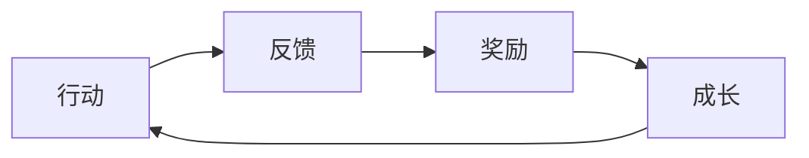

# [项目名称] 游戏概念书

> [用 2-3 句话概括这个游戏项目——类型、核心体验、目标市场。]

---

## 1. 项目概述

| 属性 | 描述 |
|------|------|
| 项目名称 | [中文名 / 英文名（暂定）] |
| 游戏类型 | [主类型 + 子类型，例如"开放世界动作RPG"] |
| 目标平台 | [PC / PS5 / Xbox / Switch / iOS / Android / 多平台] |
| 视角模式 | [第一人称 / 第三人称 / 俯视角 / 2D横版 / 等距] |
| 游玩人数 | [单人 / 多人合作 / PVP / MMO] |
| 目标分级 | [全年龄 / 12+ / 16+ / 18+] |
| 预计售价 | [定价策略——买断/F2P/订阅] |
| 预计开发周期 | [从立项到上线的预计时间] |
| 预计团队规模 | [高峰期团队人数] |

### 项目定位

[用一段话说明这个项目在市场中的定位——面向什么样的玩家，提供什么独特的价值，与同类产品相比处在什么位置。]

### 项目愿景

[用一段话描述项目的终极愿景——如果这个项目完全成功，它会是什么样子？它在游戏史上的位置是什么？]

---

## 2. 核心玩法

### 玩法概述

[用 5-8 句话描述游戏的核心玩法——玩家在游戏中主要做什么？核心操作是什么？核心目标是什么？核心挑战是什么？]

### 核心循环

[简要描述核心循环——玩家反复进行的基本行为模式。]

[替换上述 Mermaid 图为本项目实际的核心循环。]

### 关键系统

[列出支撑核心玩法的关键子系统。]

| 系统名称 | 优先级 | 描述 | 参考 |
|----------|--------|------|------|
| [系统名] | [P0/P1/P2] | [一句话描述系统功能] | [参考了哪个游戏的什么系统] |
| [...] | [...] | [...] | [...] |

### 10 分钟体验

[描述一个新玩家在游戏中的前 10 分钟会做什么——从启动游戏到第一次获得正反馈的完整流程。]

---

## 3. 目标受众

### 核心受众

| 维度 | 描述 |
|------|------|
| 年龄/性别 | [主要年龄段和性别分布] |
| 地区 | [主要目标市场地区] |
| 游戏偏好 | [他们喜欢什么类型的游戏] |
| 消费能力 | [游戏消费水平] |
| 典型代表 | [描述一个典型的目标用户画像] |

### 市场规模

[估算目标受众的市场规模——有多少潜在玩家？同类游戏的市场表现如何？]

### 获客策略

[简要描述如何触达目标受众——营销渠道、宣传策略、社区运营方向。]

---

## 4. 商业模式

### 收入模式

| 收入来源 | 描述 | 预期占比 |
|----------|------|---------|
| [买断/内购/DLC/订阅/广告/赛季通行证] | [具体的收入模式描述] | [占总收入的百分比] |
| [...] | [...] | [...] |

### 定价策略

[描述定价策略——基础售价、内购价格区间、DLC定价、促销策略。]

### 生命周期收入预估

| 阶段 | 时间范围 | 预期收入 | 主要收入来源 |
|------|---------|---------|------------|
| 首发 | [发售后1-3个月] | [预期收入范围] | [主要靠什么赚钱] |
| 中期 | [发售后3-12个月] | [...] | [...] |
| 长期 | [发售1年后] | [...] | [...] |

---

## 5. 技术方案

### 技术选型

| 维度 | 选择 | 理由 |
|------|------|------|
| 游戏引擎 | [UE5/Unity/Godot/自研/其他] | [为什么选择这个引擎] |
| 编程语言 | [C++/C#/GDScript/其他] | [技术栈选择理由] |
| 服务端 | [架构方案——如果是网络游戏] | [技术选择理由] |
| 版本管理 | [Git/Perforce/SVN] | [...] |
| CI/CD | [持续集成方案] | [...] |

### 技术风险

[列出主要的技术风险和应对策略。]

- [风险1：例如"大规模开放世界的性能优化"——应对策略：...]
- [风险2：...]

### 技术原型

[是否已有技术原型？原型验证了什么？结果如何？]

---

## 6. 里程碑

### 开发阶段

| 阶段 | 时间范围 | 目标 | 交付物 | 团队规模 |
|------|---------|------|--------|---------|
| 概念验证 | [X个月] | [验证核心玩法的可行性和乐趣] | [可玩原型] | [人数] |
| 预生产 | [X个月] | [确定所有系统的设计方案和技术方案] | [垂直切片] | [人数] |
| 生产 | [X个月] | [开发完整游戏内容] | [Alpha版本] | [人数] |
| 打磨 | [X个月] | [优化、测试、Bug修复] | [Beta/RC版本] | [人数] |
| 上线 | [X个月] | [发布和运营] | [正式版本] | [人数] |

### 关键里程碑

| 里程碑名称 | 目标日期 | 达标标准 | 决策点 |
|-----------|---------|---------|--------|
| [里程碑名] | [日期] | [什么条件达到才算通过] | [通过/不通过时的决策] |
| [...] | [...] | [...] | [...] |

---

## 7. 团队需求

### 人员配置

| 角色 | 人数 | 入场时间 | 核心职责 | 关键技能要求 |
|------|------|---------|---------|------------|
| 制作人 | [N] | [哪个阶段加入] | [核心职责] | [必备技能] |
| 策划 | [N] | [...] | [...] | [...] |
| 程序 | [N] | [...] | [...] | [...] |
| 美术 | [N] | [...] | [...] | [...] |
| QA | [N] | [...] | [...] | [...] |
| 运营 | [N] | [...] | [...] | [...] |

### 外部资源

[是否需要外包？哪些工作可以外包？预算和管理方案？]

---

## 8. 风险矩阵

| 风险领域 | 具体风险 | 可能性 | 影响 | 风险等级 | 缓解措施 | 负责人 |
|----------|---------|--------|------|---------|---------|--------|
| 技术 | [具体风险描述] | [高/中/低] | [高/中/低] | [红/黄/绿] | [缓解策略] | [谁负责监控] |
| 市场 | [...] | [...] | [...] | [...] | [...] | [...] |
| 团队 | [...] | [...] | [...] | [...] | [...] | [...] |
| 资金 | [...] | [...] | [...] | [...] | [...] | [...] |
| 竞争 | [...] | [...] | [...] | [...] | [...] | [...] |
| 政策 | [...] | [...] | [...] | [...] | [...] | [...] |

### 最坏情况预案

[如果最坏的情况发生（核心风险全部兑现），退出策略是什么？可以挽救什么？]

---

## 9. 概念书验证清单

- [ ] 项目定位是否清晰且差异化？
- [ ] 核心玩法是否经过原型验证？
- [ ] 目标受众是否有足够的市场规模？
- [ ] 商业模式是否可持续？
- [ ] 技术方案是否可行？
- [ ] 里程碑是否合理且有明确的决策点？
- [ ] 团队需求是否在可获取范围内？
- [ ] 风险评估是否充分，缓解策略是否可行？
